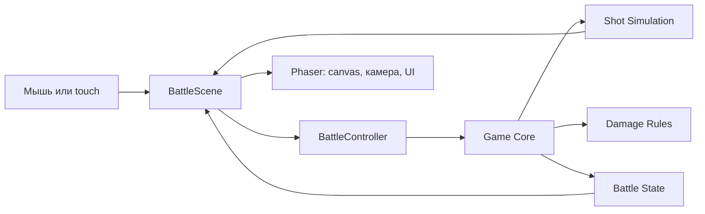
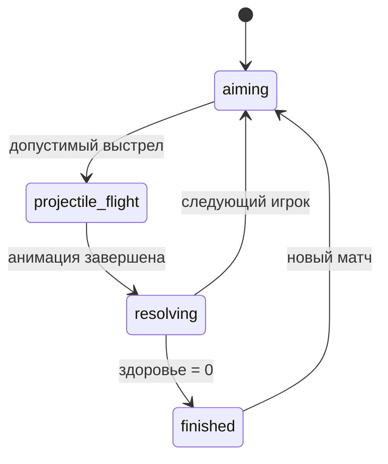
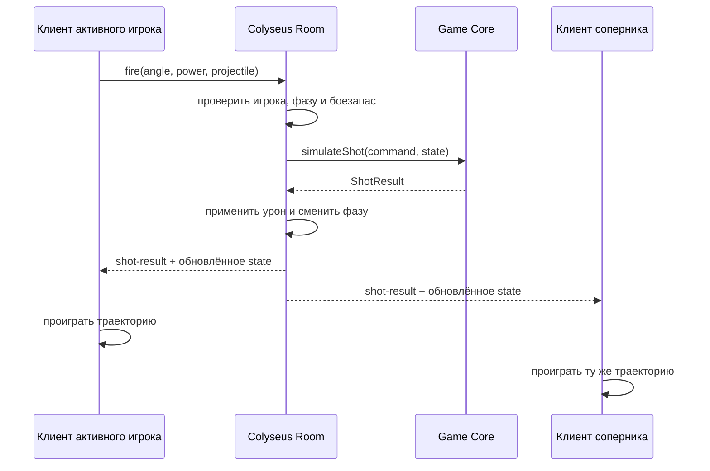

# Technical Design v0.1 — пошаговая дуэль катапульт

Статус: рабочий черновик  
Дата исследования: 29 июля 2026  
Связанный документ: [GDD v0.1](./GDD-v0.1.md)

## 1. Цель документа

Этот документ описывает, как технически создать первый прототип P0, не закрывая путь к полному боевому прототипу и онлайн-MVP.

Главный принцип: сначала один небольшой браузерный клиент с рабочим игровым ядром. Сервер, комнаты и синхронизация добавляются только после того, как локальный матч стабильно работает.

## 2. Ключевые технические решения

| Область | Решение | Зачем |
|---|---|---|
| Игровой движок | Phaser 4.1.0 | стабильная версия с рабочими TypeScript-типами в npm-пакете |
| Язык | TypeScript в строгом режиме | меньше скрытых ошибок в правилах и сетевых данных |
| Сборка | Vite | быстрый запуск и простая production-сборка |
| Среда разработки | Node.js 22.12+ или 24 LTS + npm | поддерживаемые версии, совместимые с Vite |
| Графика | WebGL через Phaser | основной современный режим Phaser 4 |
| Физика снаряда | собственный небольшой TypeScript-модуль | одинаковые расчёты на клиенте и будущем сервере |
| Столкновения P0 | круг с профилем высот и прямоугольниками | достаточно для рельефа, катапульт и препятствий |
| Тесты правил | Vitest | работает в том же TypeScript/Vite-стеке |
| Онлайн позже | Colyseus 0.17.x | комнаты, переподключение и серверная синхронизация |
| База данных | отсутствует в MVP | у MVP нет аккаунтов или постоянного прогресса |
| UI-фреймворк | не используется | React/Vue не нужны для одного игрового canvas |

Зависимости фиксируются в `package-lock.json`. Обновление major-версий не выполняется автоматически.

## 3. Почему выбраны Phaser 4 и собственная баллистика

На дату исследования последняя опубликованная стабильная версия Phaser — 4.2.1. Однако её npm-пакет декларирует `types/phaser.d.ts`, но не содержит этот файл. Для P0 зафиксирован Phaser 4.1.0, где файл типов присутствует. Это позволяет сохранить строгую проверку TypeScript без сторонних заглушек и без копирования в проект файла типов размером почти 8 МБ.

Переход на 4.2.x выполняется отдельной маленькой задачей после исправления npm-пакета или после появления подтверждённой необходимости в функциях 4.2.

Phaser предоставляет две встроенные физические системы:

- Arcade Physics — быстрая система для кругов и прямоугольников;
- Matter — более сложная система для произвольных тел, соединений и составной физики.

Для P0 ни одна из них не обязательна. У нас один летящий снаряд, неподвижные цели и пошаговый бой. Небольшая чистая функция расчёта даёт несколько преимуществ:

- правила можно проверить автоматическими тестами без запуска браузера;
- результат не зависит от частоты кадров устройства;
- тот же модуль позже запускается на авторитетном сервере;
- проще записывать и воспроизводить траекторию;
- меньше зависимостей и скрытых настроек физического движка.

Matter сейчас будет избыточным. Arcade Physics можно использовать позже для декоративных обломков, которые не влияют на результат матча.

## 4. Границы Technical Design v0.1

Документ полностью определяет:

- архитектуру и структуру P0;
- модель локального матча;
- расчёт полёта и столкновений;
- интерфейсы между сценой и игровым ядром;
- тестирование и сборку;
- направление развития до онлайн-MVP.

Документ не выбирает:

- production-хостинг;
- базу данных;
- систему аккаунтов;
- аналитику;
- платежи;
- CDN для финальных ассетов;
- масштабирование на несколько серверов.

Эти решения не нужны до подтверждения игровой механики.

## 5. Архитектура P0



### 5.1. Ответственность слоёв

**Phaser-сцены**

- показывают арену и интерфейс;
- получают ввод мыши и касания;
- анимируют готовый результат выстрела;
- не принимают решения об уроне, победе или смене хода.

**BattleController**

- принимает команду игрока;
- проверяет допустимость действия;
- вызывает симуляцию выстрела;
- применяет результат к состоянию;
- переводит матч в следующую фазу.

**Game Core**

- хранит типы и правила матча;
- не импортирует Phaser и браузерные API;
- работает одинаково в браузере, тестах и будущем Node.js-сервере.

**Конфигурация**

- хранит все балансные числа в одном месте;
- не содержит графики или ссылок на сцены;
- позволяет менять баланс без переписывания логики.

## 6. Структура проекта P0

На первом этапе используется один npm-проект, без монорепозитория.

```text
Game/
├── docs/
│   ├── GDD-v0.1.md
│   ├── Technical-Design-v0.1.md
│   └── Implementation-Backlog-P0.md
├── public/
│   └── assets/
├── src/
│   ├── main.ts
│   ├── style.css
│   └── game/
│       ├── config/
│       │   └── gameConfig.ts
│       ├── core/
│       │   ├── battleController.ts
│       │   ├── battleState.ts
│       │   ├── battleTypes.ts
│       │   ├── damage.ts
│       │   ├── random.ts
│       │   └── simulation.ts
│       ├── scenes/
│       │   ├── BootScene.ts
│       │   ├── BattleScene.ts
│       │   └── ResultScene.ts
│       └── ui/
│           └── aimingControls.ts
├── tests/
│   ├── damage.test.ts
│   ├── simulation.test.ts
│   └── turnFlow.test.ts
├── index.html
├── package.json
├── package-lock.json
├── tsconfig.json
└── vite.config.ts
```

Папки для сервера и общего npm-пакета появятся только перед онлайн-этапом.

## 7. Сцены Phaser

### 7.1. BootScene

Ответственность:

- создать временные текстуры из геометрических фигур;
- подготовить общие настройки;
- перейти в `BattleScene`.

В P0 здесь нет загрузки внешних ассетов.

### 7.2. BattleScene

Ответственность:

- создать землю, две катапульты и UI;
- отобразить текущее состояние;
- передать угол, силу и команду выстрела контроллеру;
- проиграть полученную траекторию;
- показать урон;
- перейти в `ResultScene` после победы.

`BattleScene` не вычисляет урон и не меняет активного игрока напрямую.

### 7.3. ResultScene

Ответственность:

- показать победителя;
- запустить новый матч;
- вернуться в тестовую битву без перезагрузки страницы.

Главное меню добавляется после готовности P0.

## 8. Логическая система координат

- Размер viewport: 1600 × 900.
- Размер игрового мира: 7200 × 900.
- Начало координат: левый верхний угол.
- X увеличивается вправо.
- Y увеличивается вниз.
- Гравитация имеет положительное направление по Y.
- Phaser масштабирует canvas под экран, но Game Core всегда работает в логических координатах.

Настройки масштабирования:

- пропорции сохраняются;
- canvas центрируется;
- лишнее пространство заполняется фоном;
- на телефоне используется горизонтальная ориентация;
- UI располагается с учётом safe area.

## 9. Модель состояния P0

Минимальное состояние матча:

```ts
type PlayerId = "left" | "right";
type ProjectileType = "stone" | "fire" | "ice" | "diamond" | "bomb";
type AmmunitionCount = number | null; // null = без ограничений

type BattlePhase =
  | "aiming"
  | "projectile-flight"
  | "resolving"
  | "finished";

interface PlayerState {
  id: PlayerId;
  health: number;
  catapultX: number;
  catapultY: number;
  ammunition: Record<ProjectileType, AmmunitionCount>;
  selectedProjectileType: ProjectileType;
}

interface BattleState {
  arenaId: ArenaId;
  placement: MatchPlacement;
  protections: ProtectionState[];
  obstacles: Record<string, ArenaObstacleState>;
  phase: BattlePhase;
  activePlayerId: PlayerId;
  turnNumber: number;
  players: Record<PlayerId, PlayerState>;
  winnerId: PlayerId | null;
}
```

Состояние хранит только данные, влияющие на правила. Phaser-объекты, тексты, камеры и анимации в него не попадают.

`MatchPlacement` хранит индекс одного из трёх слотов катапульты и не более трёх
пар `{ slotIndex, protectionType }` для каждого игрока. Ядро проверяет
диапазоны слотов, уникальность, бюджет 4 и ограничение одного металлического
листа до создания боевого состояния.

## 10. Команды и результаты

### 10.1. Команда выстрела

```ts
interface FireCommand {
  playerId: PlayerId;
  angleDeg: number;
  power: number;
  projectileType: ProjectileType;
}
```

### 10.2. Проверки команды

Контроллер отклоняет выстрел, если:

- матч находится не в фазе `aiming`;
- команду отправляет не активный игрок;
- угол меньше 10° или больше 80°;
- сила меньше 20 или больше 100;
- предыдущий выстрел ещё не завершён;
- матч уже закончен;
- передан неизвестный или не выбранный текущим игроком тип снаряда;
- запас выбранного специального снаряда равен нулю.

UI ограничивает значения заранее, но Game Core всё равно проверяет их самостоятельно. Это понадобится для безопасного онлайна.

### 10.3. Результат выстрела

```ts
interface FlightPoint {
  timeMs: number;
  x: number;
  y: number;
}

interface ImpactEvent {
  targetId: string;
  x: number;
  y: number;
  impactSpeed: number;
  damage: number;
}

interface ShotResult {
  points: FlightPoint[];
  impact: ImpactEvent | null;
  objectImpact: ObjectImpactEvent | null;
  endReason: "impact" | "ground" | "obstacle" | "out-of-bounds" | "timeout";
}
```

Сцена получает готовый `ShotResult` и анимирует снаряд по точкам. Она не пересчитывает последствия.

## 11. Симуляция полёта

### 11.1. Фиксированный шаг

- Частота расчёта: 180 шагов в секунду.
- `dt = 1 / 180`.
- Максимальная длительность одного выстрела: 10 секунд.
- Максимальное число шагов: 1800.
- Точки для анимации сохраняются 30 раз в секунду, то есть каждый шестой шаг.

Фиксированный шаг означает, что слабый телефон и быстрый компьютер получают одинаковый результат.

### 11.2. Интеграция

Для каждого шага используется простой полунеявный Euler:

```text
velocityX += windAcceleration × projectileWindFactor × dt
velocityY += gravity × dt
positionX += velocityX × dt
positionY += velocityY × dt
```

Стартовые скорость, гравитация и коэффициенты берутся из GDD.

### 11.3. Столкновения P0–P1

- Снаряд представлен кругом радиусом от 7 до 11 в зависимости от типа.
- Катапульта представлена неподвижным прямоугольником 72 × 66.
- Земля представлена кусочно-линейным профилем высот.
- Защита представлена неподвижными прямоугольниками.
- Каждое активное препятствие арены представлено набором из трёх неподвижных
  прямоугольных частей с общим `targetId`. Это приближает физику к нарисованному
  силуэту без отдельного физического движка и без изменения модели урона.
- Их прочность хранится в `BattleState`; при нуле collider не передаётся в
  следующую симуляцию выстрела.
- Минимальная толщина collider цели — 66 единиц.
- При первом значимом столкновении снаряд завершает полёт.
- Отскоки в P0 отсутствуют.

При максимальной скорости огненный снаряд проходит не более 16,5 единицы за
один физический шаг. Это существенно меньше минимальной толщины collider цели,
поэтому для текущих неподвижных объектов достаточно проверки круга на каждом
шаге.

Если в P1 появятся тонкие или быстро движущиеся объекты, добавляется swept collision. Частоту симуляции не следует бесконечно увеличивать.

На P1-09 все слоты расстановки дополнительно проверяются тестами: опорная
поверхность под полной шириной объекта должна быть ровной, а collider не должен
пересекать препятствия арены. Центральный рельеф остаётся кусочно-линейным и
неразрушаемым.

### 11.4. Завершение полёта

Полёт завершается, если:

- произошло столкновение;
- снаряд ушёл за границы мира с запасом 100 единиц;
- прошло 10 секунд симуляции.

Любое завершение создаёт один однозначный результат, после которого контроллер применяет урон и меняет ход.

## 12. Урон

Урон рассчитывается отдельной чистой функцией:

```ts
calculateDirectDamage({
  baseDamage,
  impactSpeed,
  materialCoefficient,
}): number
```

Функция использует формулу из GDD:

```text
impactFactor = clamp(impactSpeed / 700, 0.6, 1.2)
damage = round(baseDamage × impactFactor × materialCoefficient)
```

Ограничения:

- одна цель получает прямой урон от выстрела не более одного раза;
- здоровье ограничивается диапазоном от 0 до 100;
- после применения урона сразу проверяется победа;
- при отсутствии попадания здоровье не меняется.

## 13. Машина состояний матча



Правила переходов:

- только `BattleController` меняет фазу;
- в `projectile-flight` ввод прицеливания заблокирован;
- в `resolving` применяется урон и определяется победитель;
- новый ход увеличивает `turnNumber`;
- новый матч создаёт новое состояние, а не исправляет старое вручную.

## 14. Случайность

В P0 случайность не нужна: позиции и первый игрок фиксированы для повторяемых тестов.

В P1 и онлайне используется seed матча и один документированный псевдослучайный генератор на основе 32-битных целых чисел. Seed определяет:

- погоду;
- начальный ветер;
- изменения ветра;
- первого игрока.

Клиент не выбирает seed онлайн-матча. Его создаёт сервер.

Генератор и последовательность его вызовов покрываются тестами. Нельзя использовать `Math.random()` внутри Game Core.

## 15. Конфигурация баланса

Все числа хранятся в одном объекте:

```ts
export const GAME_CONFIG = {
  viewport: { width: 1600, height: 900 },
  world: { width: 7200, height: 900 },
  physics: {
    stepHz: 180,
    gravity: 900,
    windAccelerationScale: 0.2,
    minSpeed: 800,
    maxSpeed: 2900,
    maxFlightSeconds: 10,
  },
  aiming: {
    minAngleDeg: 10,
    maxAngleDeg: 80,
    minPower: 20,
    maxPower: 100,
  },
  catapult: {
    maxHealth: 100,
    visualScale: 0.82,
    colliderWidth: 72,
    colliderHeight: 66,
  },
  projectiles: {
    stone: {
      radius: 9,
      baseDamage: 25,
      windFactor: 1,
      launchSpeedMultiplier: 0.96,
      playbackScale: 1.75,
      initialAmmo: null,
    },
    fire: { radius: 8, baseDamage: 15, windFactor: 1, launchSpeedMultiplier: 1.02, playbackScale: 1.62, initialAmmo: 2 },
    ice: { radius: 8, baseDamage: 12, windFactor: 1, launchSpeedMultiplier: 0.93, playbackScale: 1.82, initialAmmo: 2 },
    diamond: { radius: 7, baseDamage: 35, windFactor: 0.25, launchSpeedMultiplier: 0.92, playbackScale: 1.9, initialAmmo: 1 },
    bomb: { radius: 11, baseDamage: 5, windFactor: 1, launchSpeedMultiplier: 0.90, playbackScale: 2, initialAmmo: 1 },
  },
} as const;
```

Запрещено дублировать эти значения в сценах, тестах или UI. Подписи интерфейса могут читать допустимые диапазоны из конфигурации.

## 16. Управление P0

- Ползунок угла: 10–80°.
- Ползунок силы: 20–100.
- Кнопка «Огонь».
- Все элементы работают мышью и пальцем.
- Минимальная активная область кнопки — 44 × 44 CSS-пикселя.
- Во время полёта элементы блокируются визуально и функционально.
- Клавиатурное управление можно добавить для отладки, но оно не является единственным способом управления.

На P0 используются обычные HTML-элементы поверх canvas либо простые Phaser-контролы. Выбор делается при первой реализации по меньшему объёму кода. Правила игры не должны зависеть от этого выбора.

## 17. Камера и анимация

- До выстрела камера показывает активную катапульту и ближайший участок мира.
- Катапульта соперника не помещается в тот же кадр.
- После выстрела камера следует за снарядом.
- Камера интерполирует положение между сохранёнными точками `ShotResult`.
- После попадания камера задерживается на цели примерно 600 мс.
- Затем камера переводится к следующему игроку.
- UI привязан к экрану, а не к мировой камере.

Анимация может идти с разной частотой кадров, но конечное состояние всегда
берётся из Game Core. Продолжительность визуального полёта умножается на
собственный `playbackScale` выбранного снаряда. Этот коэффициент не меняет
точки и время детерминированной симуляции.

### 17.1. Большой мир P0.5

Каждая арена хранит data-only описание: точки профиля поверхности, стартовые
позиции и прямоугольные препятствия. Game Core интерполирует высоту между
соседними точками и проверяет столкновения с рельефом и препятствиями на
фиксированном шаге. Phaser рисует тот же набор данных, поэтому видимая форма
земли совпадает с физической.

Фон состоит из повторно используемых дальних секций и не участвует в
столкновениях. Дальние секции используют `scrollFactor = 0.18`, процедурные
гребни среднего плана — `0.42`, облака — `0.24` и медленный yoyo-дрейф. Эти
слои создают динамический мир, но не попадают в Game Core. UI имеет
`scrollFactor = 0`; тот же фактор явно задаётся всем
интерактивным дочерним зонам, чтобы их экранные координаты не смещались после
движения камеры. Игровые объекты находятся в координатах мира. При смене хода
камера перемещается примерно на 6000 единиц к следующей базе.

### 17.2. Механическая катапульта P0.6

`CatapultView` становится составным визуальным объектом:

- неподвижная логическая опора и collider;
- корпус с короткой пружинной отдачей;
- отдельный художественный рычаг с открытым ковшом и собственной осью;
- два отдельных художественных колеса.

Все визуальные части масштабируются коэффициентом `0.82`; логический collider
и точка запуска настроены отдельно под уменьшенный силуэт.

Положение и урон катапульты по-прежнему определяет Game Core. Пружинная отдача,
вращение колёс и реакция на попадание являются процедурной визуальной физикой и
не записываются обратно в `BattleState`.

Сцена запускает отдачу тем же `FireCommand`, а снаряд начинает визуальный полёт
в момент завершения ускоренного взмаха художественного рычага. Угол и сила
задают позу натяжения, после выстрела рычаг возвращается в неё пружинным
движением. Раздельные слои синей и оранжевой катапульт используют собственные
точки крепления и сохраняют правильное направление к противнику. Конечная
траектория и столкновения всегда берутся из готового `ShotResult`.

## 18. Траектория-подсказка

Подсказка использует тот же `simulateShot`, но:

- ограничивает время первыми 25% предполагаемого пути;
- не применяет урон;
- не меняет состояние матча;
- в P0 может показывать полную траекторию под debug-флагом;
- пересчитывается только при изменении угла или силы.

В P1 подсказка не должна проверять столкновения со скрытыми объектами противника, иначе туман войны будет раскрывать их позицию.

## 19. Обработка ошибок

Game Core возвращает типизированный результат:

```ts
type FireResult =
  | { ok: true; shot: ShotResult }
  | {
      ok: false;
      reason:
        | "wrong-phase"
        | "not-active-player"
        | "invalid-angle"
        | "invalid-power"
        | "match-finished";
    };
```

Ожидаемые ошибки не выбрасываются как исключения. Исключения используются только для нарушений внутренних инвариантов.

В пользовательском интерфейсе:

- неверная команда не ломает сцену;
- кнопка остаётся доступной после понятного исправления;
- технический stack trace не показывается игроку;
- в development-режиме ошибка выводится в консоль.

## 20. Тестирование

### 20.1. Автоматические тесты

Обязательно проверяются:

- перевод угла и силы в начальную скорость;
- симметрия левого и правого выстрела;
- одинаковый результат при одинаковом вводе;
- завершение выстрела при попадании, промахе и таймауте;
- минимальный и максимальный допустимый угол;
- минимальная и максимальная сила;
- расчёт прямого урона;
- здоровье не опускается ниже нуля;
- смена активного игрока;
- невозможность второго выстрела во время полёта;
- победа при нулевом здоровье;
- новый матч создаёт чистое состояние.

Для чисел с плавающей точкой используется допустимая погрешность, а не строгое сравнение всех знаков после запятой.

### 20.2. Ручные проверки

- полный матч можно закончить;
- управление работает мышью;
- управление работает через эмуляцию touch;
- canvas корректно масштабируется;
- экран поворота появляется в портретной ориентации;
- камера не теряет снаряд;
- UI не перекрывает катапульту;
- новый матч начинается без перезагрузки страницы.

### 20.3. Команды проверки

Планируемые npm-команды:

```bash
npm run dev
npm run typecheck
npm run test
npm run build
npm run preview
```

`build` должен отдельно запускать проверку TypeScript, потому что Vite сам по себе транспилирует TypeScript, но не выполняет полную проверку типов.

## 21. Поддерживаемые браузеры

Требование «любые браузеры» технически нельзя гарантировать. Для MVP фиксируются современные браузеры, соответствующие production-целям Vite:

- Chrome 111 и новее;
- Edge 111 и новее;
- Firefox 114 и новее;
- Safari 16.4 и новее;
- актуальные Chrome на Android;
- актуальные Safari на iOS.

Internet Explorer и старые встроенные WebView не поддерживаются.

Фактические мобильные устройства проверяются после P0. Если бизнесу потребуется более старый браузер, это станет отдельной задачей с измеримой стоимостью.

## 22. Производительность

Цели P0:

- 60 FPS на современном компьютере;
- не менее 30 FPS на среднем поддерживаемом телефоне;
- один активный снаряд;
- не более 1800 физических шагов на выстрел;
- отсутствие выделения больших массивов каждый кадр;
- canvas не рендерится в разрешении выше разумного device pixel ratio;
- расчёт выстрела не блокирует интерфейс заметно для пользователя.

Если полный расчёт выстрела станет заметным, первым шагом будет профилирование. Web Worker не добавляется заранее.

## 23. Развитие до P1

P1 расширяет существующее ядро. Уже реализованы:

- модель пяти снарядов: каталог, выбор, запас, собственные параметры полёта,
  урон и визуальные эффекты;
- чистые переходы `resolveProjectileShot` и `resolveEndOfTurnEffects`, которые
  возвращают новое состояние и список событий для интерфейса;
- статусы горения и заморозки внутри состояния игрока;
- урон бомбы по радиусу с линейным спадом, включая дружественный урон;
- seed-погода на `xorshift32`, четыре режима, новый ветер перед ходом и
  погодные модификаторы скорости, статусов и длины подсказки;
- три типа защиты и разрушаемые препятствия арен с чистыми событиями изменения
  прочности;
- последовательная локальная расстановка двух игроков с пятью защитными
  слотами и тремя позициями катапульты;

Остаются следующими шагами:

- туман войны;
- две арены из профилей высот и прямоугольных препятствий.

Сложные разрушаемые полигоны и физика обломков не добавляются. Визуальные обломки могут быть декоративными и не влиять на расчёт результата.

## 24. Архитектура онлайн-MVP

Перед онлайн-этапом проект преобразуется в npm workspaces:

```text
apps/
├── client/
└── server/
packages/
└── game-core/
```

`game-core` содержит конфигурацию, типы, симуляцию, урон и правила хода. Он не зависит от Phaser, DOM или Colyseus.



### 24.1. Почему сервер рассчитывает выстрел

- клиент нельзя считать доверенным;
- игрок не может отправить готовый урон;
- оба игрока получают один результат;
- переподключившийся игрок получает актуальное состояние;
- изменение FPS клиента не влияет на матч.

Клиент отправляет только намерение: тип снаряда, угол и силу.

### 24.2. Colyseus Room

Одна комната соответствует одному матчу:

- `maxClients = 2`;
- комната закрывается для новых игроков после подключения двоих;
- сервер является единственным владельцем изменяемого состояния;
- клиенты отправляют сообщения с запросами действий;
- постоянные данные синхронизируются через Room State;
- одноразовый `ShotResult` передаётся сообщением;
- переподключение разрешается в течение 30 секунд.

### 24.3. Команды клиента

```text
join-room
set-placement
set-ready
fire
request-rematch
leave-match
```

Каждая команда имеет схему данных, проверяется сервером и ограничивается текущей фазой матча.

### 24.4. Состояние комнаты

```text
roomCode
phase
turnNumber
activePlayerId
arenaId
weatherId
wind
players
  sessionId
  side
  health
  ready
  ammo
winnerId
```

Траектория не хранится постоянно в Room State. Она является событием выстрела.

### 24.5. Туман войны

Скрытые позиции нельзя отправлять обоим клиентам в открытом виде. Варианты:

- Colyseus State View фильтрует поля для конкретного клиента;
- либо сервер отправляет приватную расстановку отдельным сообщением только владельцу.

Предпочтение — State View, потому что Colyseus официально поддерживает разные представления состояния для клиентов. Решение проверяется отдельным сетевым прототипом до реализации полного тумана войны.

### 24.6. Код комнаты

- короткий код генерирует сервер;
- код не содержит похожие символы вроде `0/O` и `1/I`;
- сервер проверяет уникальность;
- код нельзя использовать после закрытия комнаты;
- в MVP код является приглашением, но не полноценной авторизацией.

## 25. Безопасность онлайн-MVP

- Сервер не доверяет углу, силе, боезапасу, активному игроку и урону клиента.
- Все числовые поля проверяются на диапазон и конечность.
- `NaN` и `Infinity` отклоняются.
- Размер входящих сообщений ограничивается.
- Частота сообщений ограничивается на комнату и клиента.
- Нельзя отправить второй выстрел до завершения текущего.
- В логах не хранятся секреты или персональные данные.
- Аккаунтов в MVP нет.

Защита от DDoS, полноценная авторизация и коммерческий anti-cheat выходят за рамки MVP.

## 26. Хранение данных

P0 и P1:

- состояние существует только в памяти вкладки;
- настройки звука могут позже храниться в `localStorage`;
- игровой прогресс не сохраняется.

Онлайн-MVP:

- состояние существует в памяти серверной комнаты;
- после завершения и закрытия комнаты данные удаляются;
- база данных не требуется.

Если появятся аккаунты, рейтинг или история матчей, схема хранения проектируется отдельным документом и только после подтверждения.

## 27. Логи и диагностика

P0:

- development-лог начала и результата выстрела;
- debug-режим для полной траектории и коллизионных областей;
- production-сборка не выводит подробный лог каждый кадр.

Онлайн:

- создание и закрытие комнаты;
- подключение и отключение игрока;
- отклонённые команды с безопасной причиной;
- идентификатор матча и номер хода;
- ошибки симуляции.

Лог не должен содержать весь массив точек траектории без отдельного debug-флага.

## 28. Критерии готовности технической части P0

- проект запускается одной командой;
- production-сборка создаётся без ошибок;
- TypeScript работает в строгом режиме;
- Phaser показывает сцену 1600 × 900 с адаптивным масштабированием;
- Game Core не импортирует Phaser;
- одинаковая команда создаёт одинаковый `ShotResult`;
- игровые правила покрыты unit-тестами;
- полный матч завершается;
- мышь и touch позволяют сделать выстрел;
- новый матч запускается без перезагрузки;
- в коде нет сервера, базы данных или финальных ассетов.

## 29. Риски и способы снизить их

| Риск | Вероятность | Что делаем |
|---|---|---|
| Баллистика ощущается скучной | высокая | сначала P0 и быстрые тесты параметров |
| Снаряд пролетает сквозь тонкую цель | средняя | шаг 180 Hz, минимальная толщина 86, затем swept collision при необходимости |
| UI неудобен на телефоне | высокая | touch с первой версии, горизонтальный режим, ручной тест |
| Phaser 4 имеет свежие несовместимости | средняя | фиксируем 4.1.0 с рабочими типами и используем только базовые API |
| Онлайн расходится между игроками | высокая без мер | сервер считает выстрел и отправляет один результат |
| Архитектура становится слишком большой | средняя | один клиентский проект до онлайн-этапа |
| Туман раскрывает скрытые позиции | средняя | не передавать приватные поля второму клиенту |
| Матч зависает без таймера | средняя | проверить на P1, перед онлайном решить вопрос таймера |

## 30. Решения, требующие подтверждения прототипом

1. Достаточно ли круга и прямоугольников для нужного ощущения попадания.
2. Нужны ли отскоки камня.
3. Должен ли визуальный снаряд точно проходить через каждую сохранённую точку или допустимо сглаживание.
4. Удобнее ли HTML UI поверх canvas или Phaser UI.
5. Нужен ли Web Worker для расчёта более сложных выстрелов P1.
6. Достаточно ли 30 точек траектории в секунду для плавной онлайн-анимации.
7. Подходит ли Colyseus State View для тумана войны без лишней сложности.

## 31. Официальные источники

- [Phaser 4.2.1 — официальный релиз](https://phaser.io/download/release/v4.2.1)
- [Phaser: установка и TypeScript](https://docs.phaser.io/phaser/getting-started/installation)
- [Phaser: Arcade Physics и Matter](https://docs.phaser.io/phaser/concepts/physics)
- [Phaser: ручной шаг Arcade Physics](https://docs.phaser.io/phaser/concepts/physics/arcade)
- [Vite: начало работы и требования Node.js](https://vite.dev/guide/)
- [Vite: TypeScript требует отдельной проверки типов](https://vite.dev/guide/features.html#typescript)
- [Vite: production browser targets](https://vite.dev/guide/build.html#browser-compatibility)
- [Node.js: поддерживаемые LTS-релизы](https://nodejs.org/en/about/previous-releases)
- [Vitest: TypeScript-тесты](https://vitest.dev/guide/learn/writing-tests.html)
- [Colyseus: комнаты](https://docs.colyseus.io/room)
- [Colyseus: серверная синхронизация состояния](https://docs.colyseus.io/state)
- [Colyseus 0.17: официальный migration guide](https://docs.colyseus.io/migrating/0.17)
